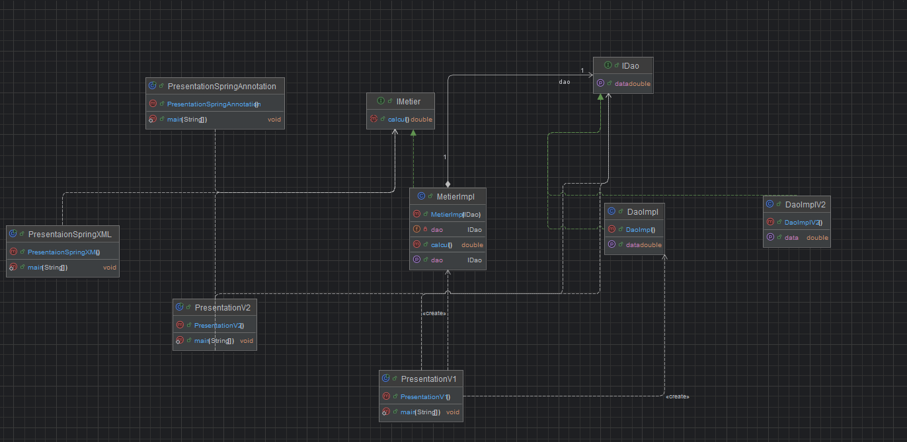

# Dependency Injection with Spring Framework

## Overview

This practical work demonstrates the concept of Dependency Injection (DI) and loose coupling in software architecture.

The same example was implemented using different approaches in order to understand the evolution from manual instantiation to a fully managed IoC container using Spring Framework.

The implemented approaches are:

- Static dependency injection
- Dynamic dependency injection using Reflection
- Spring Framework using XML configuration
- Spring Framework using Annotation-based configuration

---

## Project Structure

The application follows a layered architecture:

- Presentation Layer
- Business Layer (Metier)
- Data Access Layer (DAO)

Dependencies are defined using interfaces to ensure loose coupling between layers.

---

## DAO Layer

### IDao Interface

```java
public interface IDao {
    double getData();
}
```

### DaoImpl Implementation

```java
@Component
public class DaoImpl implements IDao {

    @Override
    public double getData() {
        return Math.random() * 100;
    }
}
```

The DAO layer simulates a data source.

---

## Business Layer

### IMetier Interface

```java
public interface IMetier {
    double calcul();
}
```

### MetierImpl Implementation

```java
@Service
public class MetierImpl implements IMetier {

    @Autowired
    private IDao dao;

    @Override
    public double calcul() {
        double data = dao.getData();
        return data * 2;
    }
}
```

The business layer depends on the abstraction `IDao`.  
Spring injects the dependency automatically using `@Autowired`.

---

## Spring Configuration (Annotations)

### Configuration Class

```java
@Configuration
@ComponentScan(basePackages = {"dao", "metier"})
public class SpringConfig {
}
```

### Presentation Class

```java
public class PresentationSpringAnnotation {

    public static void main(String[] args) {

        ApplicationContext context =
            new AnnotationConfigApplicationContext(SpringConfig.class);

        IMetier metier = context.getBean(IMetier.class);
        System.out.println("Result = " + metier.calcul());
    }
}
```

Spring container is responsible for:

- Creating objects (Beans)
- Injecting dependencies
- Managing object lifecycle

---

## XML Configuration Version

In the XML-based configuration, beans are declared inside `applicationContext.xml`.

```xml
<bean id="dao" class="dao.DaoImpl"/>

<bean id="metier" class="metier.MetierImpl">
    <property name="dao" ref="dao"/>
</bean>
```

Spring performs setter-based dependency injection automatically.

---

## Class Diagram

<h2>Class Diagram</h2>

<p align="center">
  
</p>

---

## Comparison of Approaches

| Approach | Dependency Management | Coupling |
|------------|----------------------|----------|
| Static Injection | Manual instantiation | High |
| Dynamic Injection | Reflection | Medium |
| Spring XML | IoC Container | Low |
| Spring Annotations | IoC Container | Very Low |

---

## Conclusion

This practical work highlights the importance of Dependency Injection and loose coupling in modern software development.

Using Spring Framework simplifies dependency management, improves maintainability, and promotes scalable architecture design.

The annotation-based configuration represents the modern and recommended approach in enterprise-level applications.

---
